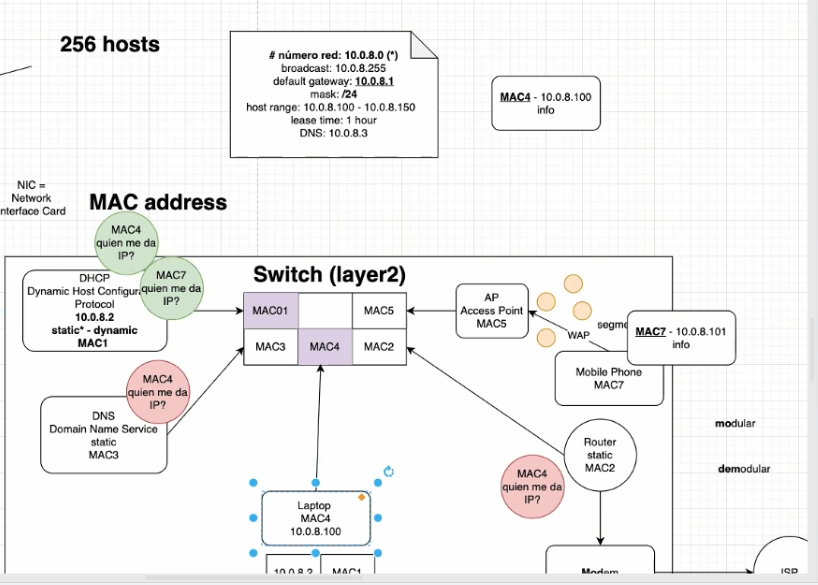
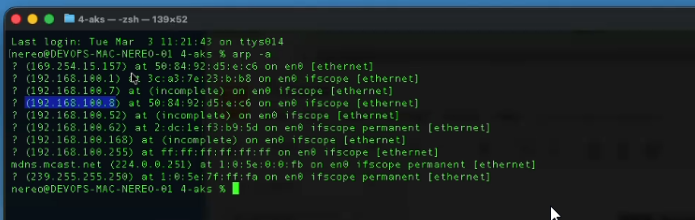
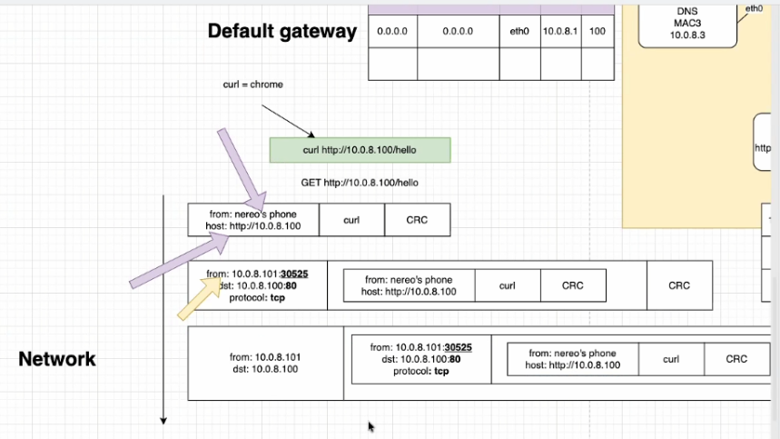
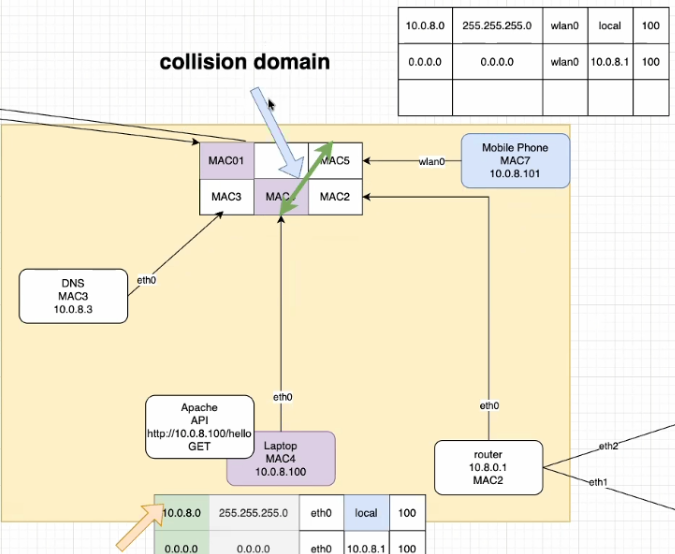
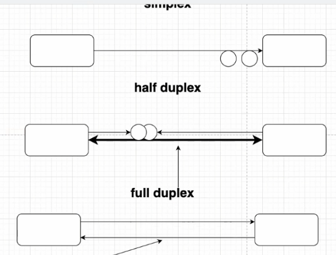
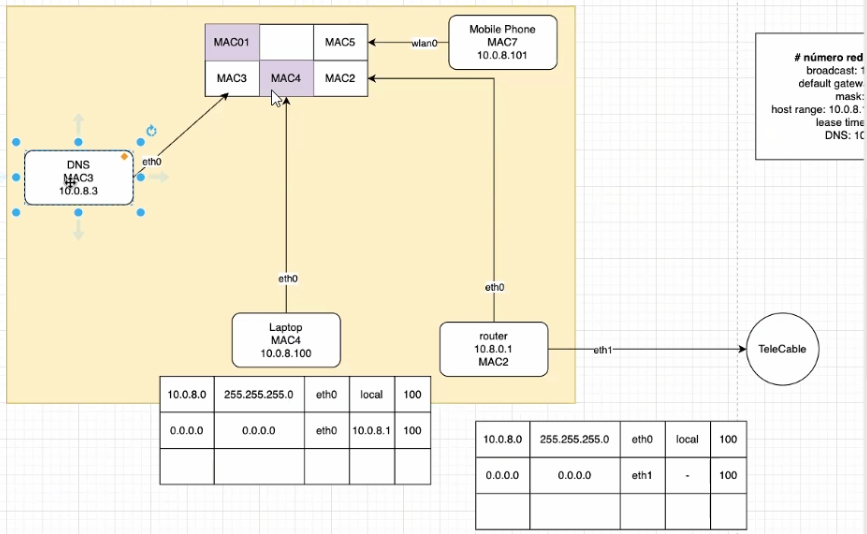
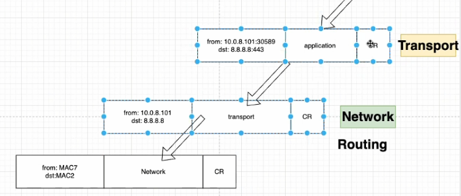
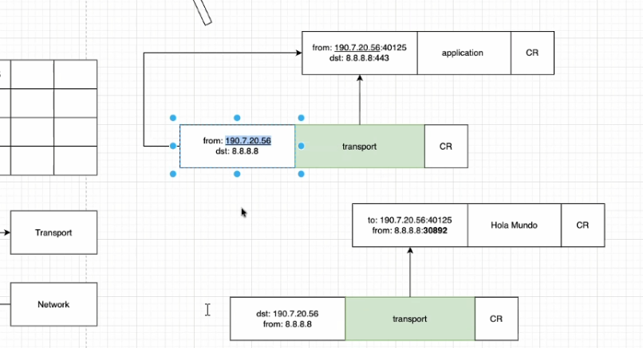
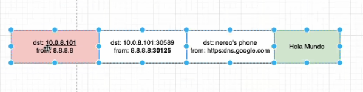

# Apuntes de Clase - IC-7602 Redes
**Estudiante:** Joshua Obando Castro 
**Carné:** 2023130774  
**Fecha:** 10 de marzo, 2026  
**Apunte #:** A 1 

---

## 1. DHCP - Configuración Automática de Red

Cuando un dispositivo se conecta a una red (por cable o inalámbrico), lo primero que ocurre es que envía un mensaje broadcast hacia todas las posibles direcciones de la red local. Este mensaje indica su MAC address y pregunta si hay alguien que le pueda prestar una configuración de red (dirección IP). Este proceso es manejado por el protocolo **DHCP (Dynamic Host Configuration Protocol)**.

El servidor DHCP responde con la siguiente información:

| Parámetro | Descripción |
|---|---|
| Número de red | Identifica la red a la que pertenece el dispositivo |
| Dirección IP | IP asignada al dispositivo |
| Default Gateway | IP del router al que se envía el tráfico externo |
| Dirección Broadcast | Dirección para enviar mensajes a toda la red |
| Tiempo de Lease | Tiempo que el dispositivo puede usar esa IP prestada |
| DNS | Servidor de resolución de nombres de dominio |

Una vez que el DHCP responde con la configuración, el dispositivo aprende el MAC address del servidor DHCP. Esto es gestionado por el protocolo **ARP (Address Resolution Protocol)**, que mantiene un mapeo entre dirección IP y dirección física (MAC).

El comando `arp -a` en terminal permite ver la tabla ARP actual de una máquina, mostrando los mapeos IP → MAC conocidos:

---

## 2. Encapsulamiento y Viaje de un Paquete (Red Local)

Cuando un dispositivo realiza una petición de red, la información atraviesa las capas del modelo OSI de forma descendente en el origen y ascendente en el destino. Se usó el ejemplo de un teléfono (MAC7, IP `10.0.8.101`) enviando una petición HTTP a un Apache corriendo en una laptop (MAC4, IP `10.0.8.100`).

### Capa de Aplicación (L7)
Se construye el paquete HTTP con `curl http://10.0.8.100/hello` (equivalente a Chrome en consola):

- **From:** nereo's phone
- **Host:** `http://10.0.8.100/hello`
- **Payload:** petición HTTP GET
- **Trailer:** CRC

### Capa de Transporte (L4)
Envuelve el paquete de aplicación agregando puertos. El archivo `/etc/services` mapea protocolos a sus puertos (HTTP → puerto 80 TCP):

- **From:** `10.0.8.101:30525` 
- **Dst:** `10.0.8.100:80`
- **Protocolo:** TCP

### Capa de Red (L3)
Agrega solo las IPs. Aquí se toma la decisión de ruteo aplicando AND entre la máscara y la IP destino:

- `10.0.8.100 AND 255.255.255.0 = 10.0.8.0`, coincide con ruta local 
- Siempre se da prioridad a la ruta local, sobre el default gateway

### Capa de Acceso a Datos (L2)
ARP obtiene el MAC del destino y se construye el frame:

- **From MAC:** MAC7 (teléfono)
- **Dst MAC:** MAC4 (laptop)
- **Payload:** datagrama de red + CRC

El switch crea un circuito virtual (camino dedicado full-duplex) entre los dos puertos, eliminando el dominio de colisión:

El **Collision Domain** es el punto donde puede ocurrir un choque entre datos enviados simultáneamente. El switch lo elimina porque establece conexiones full-duplex dedicadas.

---

## 3. Modos de Comunicación

| Modo | Descripción |
|---|---|
| **Simplex** | Solo un sentido de comunicación. Un extremo siempre emite, el otro siempre recibe. |
| **Half Duplex** | Ambos sentidos pero comparten el canal. Se turnan por ventanas (de tiempo o paquetes). Existe riesgo de colisión. |
| **Full Duplex** | Dos canales independientes (uno por sentido). Sin colisión posible. Es lo que usa el switch con cada dispositivo. |

En Half Duplex sin ventana de tiempo, las estaciones "pelean" por el canal escuchando actividad electromagnética en el medio antes de transmitir (**CSMA/CD**).

---

## 4. Comunicación hacia Internet

Cuando el destino no está en la red local (ej: `8.8.8.8`), el proceso de encapsulamiento es idéntico, pero la decisión de ruteo lleva el paquete al **default gateway** (el router).

**Diferencia clave en L2:** cuando el destino es externo, ARP busca el MAC del router (no el del destino final):

- **MAC Fuente:** MAC7 (teléfono)
- **MAC Destino:** MAC2 (router), no el servidor final

El router desencapsula hasta L3, consulta su tabla de ruteo y decide por cuál ISP reenviar:

El router aplica el mismo algoritmo AND para decidir por cuál interfaz (eth1, TeleCable, eth2, Kolbi) enviar el paquete. La ruta con menor número de prioridad gana.

### Problema de las IPs Privadas en Internet

Los rangos privados (`10.0.0.0/8`, `192.168.0.0/16`, `172.16.0.0/12`) están diseñados para usarse únicamente dentro de redes locales. Si un paquete sale a Internet con IP fuente privada, ocurre ambigüedad: dos redes en el mundo pueden tener el mismo rango y el servidor de destino no sabrá a quién devolver la respuesta.

El paquete quedaría brincando de router en router hasta alcanzar el límite de saltos (TTL = 30 hops), momento en que es descartado.

---

## 5. NAT, Network Address Translation

Para resolver el problema de las IPs privadas, el router aplica **NAT** (o *masquerade* en iptables). Esta operación cambia la identidad del paquete justo antes de enviarlo al ISP.

### Proceso de salida

1. Guarda en una tabla NAT: IP privada origen + puerto origen
2. Asigna un puerto aleatorio (>= 30000) en la interfaz pública
3. Reemplaza IP fuente privada, IP pública del router
4. Reemplaza puerto fuente, puerto aleatorio asignado
5. Guarda el mapeo: `IP_pública:puerto_nuevo = IP_privada:puerto_original`

| IP Interna : Puerto | IP Pública : Puerto NAT |
|---|---|
| `10.0.8.101 : 30589` | `190.7.20.56 : 40125` |

### Proceso Inverso (respuesta)

Cuando el servidor responde a la IP pública del router, este:

1. Recibe el paquete en su IP pública por el puerto NAT
2. Consulta la tabla NAT y encuentra el mapeo
3. Sustituye IP destino, IP interna y puerto, puerto original
4. Ejecuta tabla de ruteo: destino es local, envía por eth0
5. Usa ARP para obtener el MAC del teléfono y entrega el paquete

